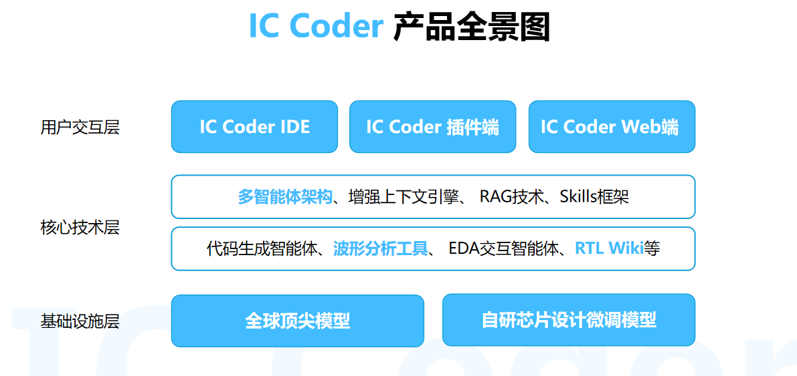

 

 

## 关于我

 

<table width="100%">
<tr>
<td width="50%" align="center">

### 个人简介

 

FPGA设计工程师

5年开发经验

曾集创赛国一选手

专注FPGA技术研究

 

</td>

<td width="50%" align="center">

### 影响力数据

 

全网粉丝 1W+

博客阅读 20W+

CSDN • 公众号 • B站

专注FPGA技术分享

 

</td>
</tr>
</table>

 

### 专业领域

 

 

### 个人理念

> _"力求做到最好，做到极致"_

 

---

## 公司介绍

 
既是AI应用行业解决方案提供商，也是芯片行业解决方案提供商
下设AI应用部门、芯片设计与验证部门和教仪事业部三大板块，
专注做 AI 赋能芯片研发的先行者

 

### 三大部门

 

<table width="100%">
<tr>
<td width="33%" align="center" valign="top">

### AI应用部门

 

沉淀了私有化大模型、多云混合部署、智能体架构研发、问题检索、数据治理与合规的一站式能力。

 

</td>
<td width="33%" align="center" valign="top">

### 芯片设计与验证部门

 

沉淀了在半导体、时域与可靠性约束下完成从需求梳理、系统架构、RTL/固件开发、仿真验证、板级调试到量产交付的全流程实施能力。

 

</td>
<td width="33%" align="center" valign="top">

### 教仪事业部

 

为合作高校带来高品质教学改革、AI智能体应用、实验室建设等解决方案，IC Coder高校提供赋能力高校培养更高质量的人才。

 

</td>
</tr>
</table>

 

### 公司价值观

 

 

---

## 核心产品

 

---

## 内容创作平台

<table>
  <tr>
  <td align="center" width="25%">
  
   <b>B站频道</b>
   FPGA技术教程
   <a href="https://space.bilibili.com/3546751097113185?spm_id_from=333.337.search-card.all.click">最新视频 →</a>
  </td>
  <td align="center" width="25%">
  
   <b>抖音账号</b>
   FPGA短视频教学
   <a href="https://www.douyin.com/user/MS4wLjABAAAAHJPObv8iJ8zmUneNi20g6lZ0m5AAHMRxQJpsciMQhajYRcLxu6E2MNQXJzN631IE?from_tab_name=main&relation=0&vid=7555835852644044067">关注账号 →</a>
  </td>
    <td align="center" width="25%">
  
   <b>微信公众号</b>
   FPGA深度解析
   <a href="#">关注公众号 →</a>
  </td>
  <td align="center" width="25%">
  
   <b>CSDN博客</b>
   FPGA技术分享 阅读量20W+
   <a href="https://blog.csdn.net/Ryansweet716?ops_request_misc=%7B%22request%5Fid%22%3A%2210909972c5da999dbd7685f26fa8e55d%22%2C%22scm%22%3A%2220140713.130064515..%22%7D&request_id=10909972c5da999dbd7685f26fa8e55d&biz_id=206&utm_medium=distribute.pc_search_result.none-task-user-null-2-154590931-null-null.nonecase&utm_term=ChinaRyan&spm=1018.2226.3001.4351">最新文章 →</a>
  </td>
  </tr>
  </table>

 

## GitHub 数据统计

 

 

## 精选项目

<table>
<tr>
<td width="50%" align="center">

### [Dual-Channel-ADC-Collection-Module](https://github.com/RyanFPGA/Dual-Channel-ADC-Collection-Module)

双通道ADC采集模块

</td>
<td width="50%" align="center">

### [2025-FPGARACE-ZiGuang-2](https://github.com/RyanFPGA/2025-FPGARACE-ZiGuang-2)

2025 FPGA竞赛紫光项目

</td>
</tr>
</table>

 

### 价值观（行动准则）

**持续创新 • 聚焦专精 • 坦诚清晰 • 求真务实 • 敢为极致 • 共同成长**

<h3>
如果我的内容对你有帮助，请给我的项目点个 Star！
</h3>

